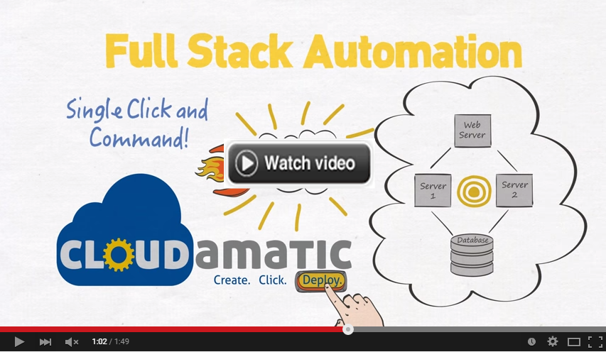
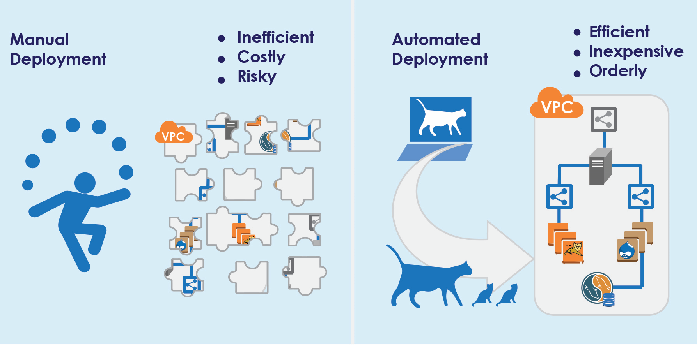

# About Cloudamatic

Cloudamatic is a complete cloud deployment solution designed to provision, orchestrate and manage complex platforms and applications. Cloudamatic's goal is to offer the ability to automate any arbitrarily complex application, platform or combination on a wide range of infrastructure targets, starting with AWS Cloud and including other clouds, virtualized environments and bare iron.

* The Cloudamatic deployment and development tooling is called "mu", and you can access it in the [mu repository](https://github.com/eGT-Labs/mu/)
* Architectural and technical basics, as well as a walkthrough are available on the [mu repository wiki](https://github.com/cloudamatic/mu/wiki)  
* Here is a link to our [overall Cloudamatic website](https://github.com/cloudamatic/cloudamatic), which currently points back to where you are

## Automating for Reliability & Agility
Instantaneously available cloud services are necessary for application agility -- but traditional systems
deployment and administration need to be automated to fully realize the associated benefits. Automated
administration replaces painstaking and error-prone manual intervention with a seamless ability to describe,
unite, and wire together the cloud services we provision with the application capabilities we want to run.

## Cloudamatic Full LifeCycle Automation
Open Source Cloudamatic delivers a non-intrusive framework to orchestrate the entire provisioning and
deployment process without requiring any changes to your application. Cloudamatic integrates with
existing tools like Jenkins and Git, provides orchestration for mid-level configuration management tools, and
can deploy applications on a range of infrastructures from a full array of AWS services to virtualized
environments and bare-metal servers.

Cloudamatic  manages critical relationships between application code and cloud resources, gluing them
together into a fully-functioning application. Previously manual tasks can now be developed once, in
repeatable code form, and deployed many times with many variations. Platform.mu bridges the gap
between cloud automation tools such as AWS CloudFormation and configuration management suites
such as Chef, Ansible and Puppet, adding further value along the way in terms of security, continuous
monitoring and log consolidation.
